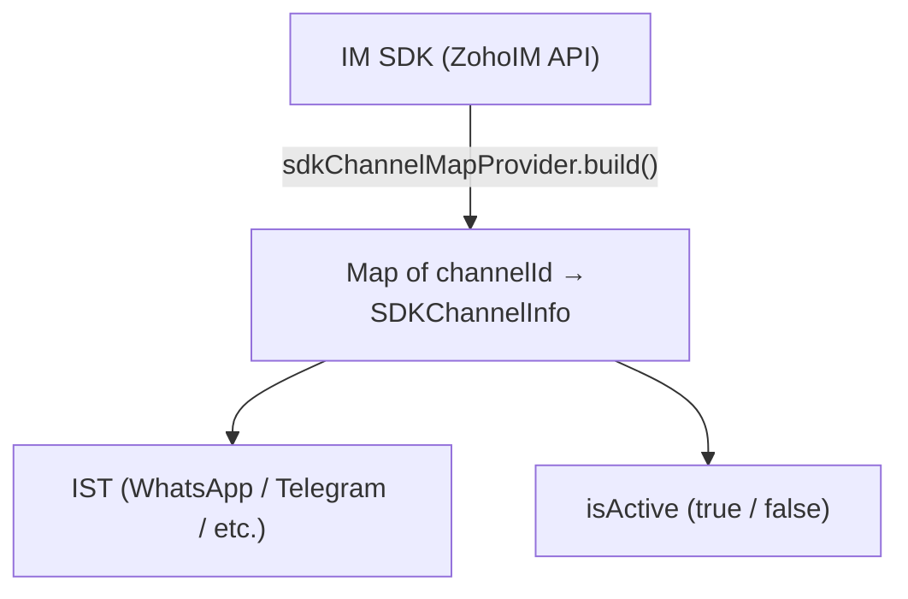
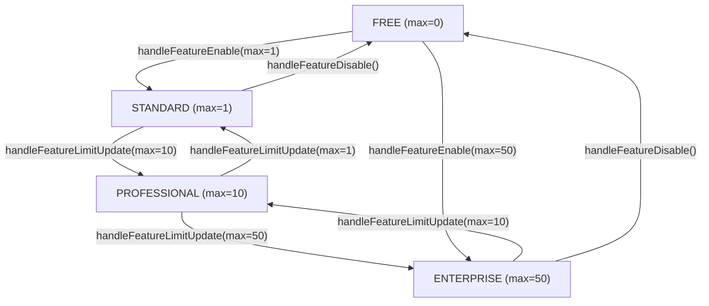

# IM Channel License — Complete Lifecycle Guide

## 1. Channel Status Lifecycle

### The 4 Statuses


  
  
  
  


### Two Types of Records

**Existing Customers — `UNKNOWN`**

Before the STATUS column existed, channels had no status. `dd-changes` added the column with `DEFAULT = 3`, so all existing records got **UNKNOWN**. These channels _might_ be active in SDK, _might_ not. We don't know until we check (reconciliation).

**New Customers — `ACTIVE`**

`CustomChannel.java` sets the field default: `channelStatus = ChannelStatus.ACTIVE`. New channels are created with status ACTIVE. No reconciliation needed — status is accurate from the start.


**Why UNKNOWN exists:** When the STATUS column was added, existing channels were already running in production. We couldn't blindly mark them ACTIVE or DISABLED — we don't know their real state. So `DEFAULT=3` (UNKNOWN) means: _"check with SDK before deciding."_

Every handler resolves UNKNOWN by:
1. Looking up the channel in SDK → is it active there?
2. If active in SDK → decide based on context (enable/disable/limit)
3. If not in SDK → mark DISABLED (it's dead)



**Important:** UNKNOWN and LICENSE_DISABLED cannot coexist in the same department. Every handler that creates LICENSE_DISABLED also resolves ALL UNKNOWN in the same invocation. So in any scenario, a department has either UNKNOWN channels (not yet processed) OR LICENSE_DISABLED channels (already processed) — never both.


### Valid State Transitions

| From | To | Triggered By |
|---|---|---|
| UNKNOWN (3) | ACTIVE (1) | Reconcile: SDK active + room available |
| UNKNOWN (3) | DISABLED (0) | Reconcile: not in SDK (dead channel) |
| UNKNOWN (3) | LICENSE_DISABLED (2) | Reconcile: SDK active + no room, or feature off |
| ACTIVE (1) | DISABLED (0) | Manual deactivate, department disabled |
| ACTIVE (1) | LICENSE_DISABLED (2) | License limit exceeded, feature disabled |
| DISABLED (0) | ACTIVE (1) | Manual activate, department enabled |
| LICENSE_DISABLED (2) | ACTIVE (1) | License limit increased, feature enabled, manual activate |


**Note:** DISABLED and LICENSE_DISABLED never transition to each other directly.


---

## 2. Plan Tiers & Limits

| Tier | Max Channels per IST |
|---|---|
| Free | 0 |
| Standard | 1 |
| Professional | 10 |
| Enterprise | 50 |


**Per-IST means:** WhatsApp limit is independent of Telegram limit. Enterprise with 50 = up to 50 WhatsApp channels _AND_ up to 50 Telegram channels.


---

## 3. Plan Upgrade/Downgrade Lifecycles

### Lifecycle 1: Free → Enterprise → Free

**Initial state:** All channels have UNKNOWN status (from dd-changes migration). License handler NOT invoked — the IM feature doesn't exist on Free.

**⬆ UPGRADE to Enterprise (maxPerIST=50)** — Trigger: `handleFeatureEnable(max=50)`



### Resolve UNKNOWN in disabled depts

UNKNOWN → check SDK → active?
- Yes → deActivate in **IM SDK** → **Desk DB**: LICENSE_DISABLED
- No → **Desk DB**: DISABLED

### Resolve UNKNOWN in active depts (limit=50)

UNKNOWN → check SDK → active?
- Yes + room → **Desk DB**: ACTIVE _(SDK already active, no SDK call)_
- Yes + no room → deActivate in **IM SDK** → **Desk DB**: LICENSE_DISABLED
- No → **Desk DB**: DISABLED

### Re-enable LICENSE_DISABLED in active depts (up to 50)

LICENSE_DISABLED → activate in **IM SDK** → **Desk DB**: ACTIVE



**Result:** Channels come alive up to 50 per IST. All UNKNOWN resolved.

**⬇ DOWNGRADE to Free** — Trigger: `handleFeatureDisable()`



### LICENSE_DISABLE all active channels

ACTIVE → deActivate in **IM SDK** → **Desk DB**: LICENSE_DISABLED

### Resolve ALL UNKNOWN

→ 0 found _(all resolved during upgrade)_



**Result:** ZERO active. All LICENSE_DISABLED (or DISABLED from manual deactivation).

---

### Lifecycle 2: Enterprise → Free → Enterprise

**Initial state:** Many channels ACTIVE across departments. May have UNKNOWN channels if customer was Enterprise pre-migration.

**⬇ DOWNGRADE to Free** — Trigger: `handleFeatureDisable()`



### LICENSE_DISABLE all active channels

ACTIVE → deActivate in **IM SDK** → **Desk DB**: LICENSE_DISABLED

### Resolve ALL UNKNOWN

UNKNOWN → check SDK → active? deActivate → LICENSE_DISABLED. Not active? → DISABLED




**Why LICENSE_DISABLED (not DISABLED)?** The channel itself is fine — only the LICENSE prevents it. If they upgrade again, we restore them.


**⬆ UPGRADE back to Enterprise (max=50)** — Trigger: `handleFeatureEnable(max=50)`



### Resolve UNKNOWN in disabled depts → 0 found

### Resolve UNKNOWN in active depts → 0 found

### Re-enable LICENSE_DISABLED in active depts

LICENSE_DISABLED → activate in **IM SDK** → **Desk DB**: ACTIVE. All channels per IST come back!




**Result:** Channels restored exactly as before.

**Key insight:** LICENSE_DISABLED preserves the channel for re-activation. DISABLED means "user chose to turn it off" — license handler doesn't touch it.


---

### Lifecycle 3: Standard → Enterprise → Standard

**Initial state:** Standard (maxPerIST=1) — 1 WhatsApp channel ACTIVE per IST.

**⬆ UPGRADE to Enterprise (max=50)** — Trigger: `handleFeatureLimitUpdate(max=50)`



### Disable ACTIVE in disabled depts → LICENSE_DISABLED

### Resolve UNKNOWN in disabled depts

### Build active count

### Resolve UNKNOWN in active depts

### Trim excess? 1 active, limit 50 → no excess

### Re-enable LICENSE_DISABLED in active depts

LICENSE_DISABLED → activate in **IM SDK** → **Desk DB**: ACTIVE



**Result:** User can now activate up to 50 channels per IST.

**⬇ DOWNGRADE to Standard (max=1)** — Trigger: `handleFeatureLimitUpdate(max=1)`

_(User created 10 WA channels while on Enterprise — all ACTIVE)_



### Disable ACTIVE in disabled depts → LICENSE_DISABLED

### Resolve UNKNOWN in disabled depts

### Build active count: 10 WA active in active depts

### Resolve UNKNOWN in active depts

### TRIM EXCESS

10 active, limit 1 → excess = 9. Disable from TAIL: ch10, ch9… ch2 → deActivate in **IM SDK** → **Desk DB**: LICENSE_DISABLED. **ch1 survives**.

### Re-enable LICENSE_DISABLED? 0 room left → nothing restored



**Result:** 1 ACTIVE, 9 LICENSE_DISABLED (restorable on upgrade).

---

### Lifecycle 4: Enterprise → Standard → Enterprise

**Initial state:** Enterprise (max=50) — 10 WhatsApp channels ACTIVE.

**⬇ DOWNGRADE to Standard (max=1)** — Trigger: `handleFeatureLimitUpdate(max=1)`



### Disable ACTIVE in disabled depts

### Resolve UNKNOWN in disabled depts

### Build active count: 10 WA active in active depts

### Resolve UNKNOWN in active depts

### TRIM EXCESS

Excess = 10 − 1 = 9. ch10→ch2 → deActivate in **IM SDK** → **Desk DB**: LICENSE_DISABLED. **ch1 stays ACTIVE**.

### Re-enable LICENSE_DISABLED? 0 room left → nothing restored



**Result:** 1 ACTIVE, 9 LICENSE_DISABLED.

**⬆ UPGRADE back to Enterprise (max=50)** — Trigger: `handleFeatureLimitUpdate(max=50)`



### Disable ACTIVE in disabled depts → 0 found

### Resolve UNKNOWN in disabled depts → 0 found

### Build active count: 1 WA active

### Resolve UNKNOWN in active depts → 0 found

### Trim? 1 active, limit 50 → no excess

### Re-enable LICENSE_DISABLED in active depts

Room = 50 − 1 = 49. 9 LICENSE_DISABLED → activate in **IM SDK** → **Desk DB**: ACTIVE.



**Result:** All 10 channels active again. Nothing lost.

---

## 4. Department Enable/Disable Lifecycles

### Lifecycle 5a: Dept ON → Disable → Enable (UNKNOWN channels)

This happens when the department event is the **first event** to process these channels after migration.

**Initial state:** Dept 1 is ON. Has 3 WA channels, all UNKNOWN (from dd-changes migration).

**⬇ DISABLE Department 1** — Trigger: Kafka async → `DepartmentDisableIMChannelHandler` — Fetches: **ACTIVE + UNKNOWN**



### ACTIVE channels: none found (all are UNKNOWN)

### Resolve UNKNOWN channels

- ch1 (UNKNOWN) → check SDK → active? deActivate in **IM SDK** → **Desk DB**: DISABLED
- ch2 (UNKNOWN) → same → **Desk DB**: DISABLED
- ch3 (UNKNOWN) → same → **Desk DB**: DISABLED




**Note:** Dept handler always sets DISABLED (not LICENSE_DISABLED). All UNKNOWN resolved.


**Result:** 0 ACTIVE, 3 DISABLED in dept 1.

**⬆ ENABLE Department 1** — Trigger: Sync call → `DepartmentEnableIMChannelHandler` — Fetches: **DISABLED + UNKNOWN**



### Check license limit: maxPerIST = 0? → Exit (Free plan)

### Restore DISABLED channels

`room = maxPerIST − currentActiveCount` (across ALL depts)
- ch1 → activate in **IM SDK** → **Desk DB**: ACTIVE. Room decremented.
- ch2 → room left? Yes → ACTIVE
- ch3 → room left? No → stays DISABLED

### No UNKNOWN to resolve (all resolved during disable)



**Result:** Channels come back (within license limit).

---

### Lifecycle 5b: Dept ON → Disable → Enable (LICENSE_DISABLED channels)

**Initial state:** Dept 1 is ON, Enterprise (max=50). Has 5 WA channels: 4 ACTIVE + 1 LICENSE_DISABLED (from a previous license downgrade).

**⬇ DISABLE Department 1** — Fetches: **ACTIVE + UNKNOWN only** — LICENSE_DISABLED is invisible.



### ACTIVE channels: ch1–ch4 → deActivate in IM SDK → Desk DB: DISABLED

### Resolve UNKNOWN → 0 found




**Note:** LICENSE_DISABLED channel (ch5) is NOT fetched. NOT processed. Stays LICENSE_DISABLED. Dept handler is blind to LICENSE_DISABLED.


**⬆ ENABLE Department 1** — FIXED: now also fetches LICENSE_DISABLED



### Check license limit: maxPerIST = 50 → proceed

### Restore DISABLED: ch1–ch4 → ACTIVE

### Resolve UNKNOWN → 0 found

### Restore LICENSE_DISABLED (FIXED)

ch5 (LICENSE_DISABLED) → activate in **IM SDK** → **Desk DB**: ACTIVE



**Result:** All 5 channels ACTIVE.

---

### Lifecycle 6a: Dept OFF → Enable → Disable (UNKNOWN channels)

**Initial state:** Dept 2 is OFF. Has 3 WA channels, all UNKNOWN. No handler has ever processed these.

**⬆ ENABLE Department 2** — maxPerIST=5, currently 3 WA active. Room = 2.



### Check license limit: maxPerIST = 5 → proceed

### No DISABLED channels to restore

### Resolve UNKNOWN channels (room=2)

- ch1 → SDK active? Yes + room → ACTIVE. Room left: 1
- ch2 → SDK active? Yes + room → ACTIVE. Room left: 0
- ch3 → SDK active? Yes + **no room** → deActivate in **IM SDK** → LICENSE_DISABLED



**Result:** 2 ACTIVE (ch1, ch2) + 1 LICENSE_DISABLED (ch3). All UNKNOWN resolved.

**⬇ DISABLE Department 2** — Fetches: **ACTIVE + UNKNOWN only**



### ch1, ch2 (ACTIVE) → deActivate in IM SDK → Desk DB: DISABLED

### Resolve UNKNOWN → 0 found



LICENSE_DISABLED channel (ch3) is NOT fetched. Stays LICENSE_DISABLED.

**Result:** 2 DISABLED + 1 LICENSE_DISABLED in dept 2.

---

### Lifecycle 6b: Dept OFF → Enable → Disable (LICENSE_DISABLED channels)

**Initial state:** Dept 2 is OFF. ch1, ch2, ch3 → DISABLED. ch4 → LICENSE_DISABLED (from prior license downgrade).

**⬆ ENABLE Department 2** — maxPerIST=5, currently 2 WA active. Room = 3.



### Check license limit: maxPerIST = 5 → proceed

### Restore DISABLED (room=3): ch1, ch2, ch3 → ACTIVE. Room left: 0.

### No UNKNOWN to resolve

### Restore LICENSE_DISABLED (FIXED)

ch4 (LICENSE_DISABLED) → activate in **IM SDK** → **Desk DB**: ACTIVE



**Result:** All 4 channels ACTIVE.

**⬇ DISABLE Department 2**



### ch1, ch2, ch3 (ACTIVE) → deActivate in IM SDK → Desk DB: DISABLED

### Resolve UNKNOWN → 0 found



LICENSE_DISABLED channel (ch4) is NOT fetched. Stays LICENSE_DISABLED (still stranded).

**Result:** 3 DISABLED + 1 LICENSE_DISABLED (ch4 still stranded) in dept 2.

---

## 5. Manual Channel Operations

### Manual Activate (REST API → `activateChannel`)



### Lookup channel by externalId

### Check license

- Already ACTIVE? → **Skip check**
- UNKNOWN + active in IM SDK? → **Skip check** _(just resolving status)_
- DISABLED / LICENSE_DISABLED → Check limit → Throws `DeskLicenseException` if over limit

### Activate in IM SDK

### Desk DB → ACTIVE



### Manual Deactivate (REST API → `deActivateChannel`)



### Deactivate in IM SDK

### Redis cleanup: Delete `channelId + ONLINE_AGENTS`

### Desk DB → DISABLED (always DISABLED, never LICENSE_DISABLED)



### Lean Activate/Deactivate (Internal)

Used internally by license and dept handlers. No license check, no Redis cleanup.

| Caller | IM SDK call | Desk DB status | Redis cleanup? |
|---|---|---|---|
| License handler | deActivate | LICENSE_DISABLED (2) | No |
| Dept disable handler | deActivate | DISABLED (0) | No |
| Manual deactivate | deActivate | DISABLED (0) | Yes |
| License handler | activate | ACTIVE (1) | No |
| Dept enable handler | activate | ACTIVE (1) | No |
| Manual activate | activate | ACTIVE (1) | No |

---

## 6. Who Calls What (Trigger Map)

| Trigger | Handler | Method |
|---|---|---|
| Plan change | `IMChannelLicenseHandler` | `handleFeatureEnable` / `handleFeatureDisable` / `handleFeatureLimitUpdate` |
| Department disabled | `DepartmentDisableIMChannelHandler` | `disableHandler(MicrozEvent)` via Kafka async |
| Department enabled | `DepartmentEnableIMChannelHandler` | `enableChannels(deptId)` via sync call |
| User clicks Activate/Deactivate | `DeskIMChannelAuthorizedAPIImpl` | `activateChannel` / `deActivateChannel` via REST |
| License usage query | `IMChannelLicenseHandler` | `getUsedCount()` → read-only |


**Execution Order:** Department handler (`order=1`) runs FIRST. License handler (`order=5`) runs AFTER.

_Why?_ License handler uses `getAllActiveDepartments()` to split channels into "active dept" vs "disabled dept" buckets — it needs department state to be accurate first.


---

## 7. DISABLED vs LICENSE_DISABLED — The Key Distinction

| | DISABLED (0) | LICENSE_DISABLED (2) |
|---|---|---|
| Set by | Manual deactivate, Dept disable | License limit exceeded, Feature disabled |
| Meaning | User/admin chose to turn this off | Channel is fine, license prevents it |
| License handler | Does **NOT** touch these | **WILL** restore on limit increase |
| Dept enable handler | **WILL** try to restore | Does **NOT** touch these _(before fix)_ |
| Manual activate | WILL work (with license check) | WILL work (with license check) |


**Why this matters:**
Enterprise(50) → Standard(1): 49 channels become LICENSE_DISABLED.
Standard(1) → Enterprise(50): Those 49 _auto-restore_ to ACTIVE.

If we used DISABLED instead, the license handler couldn't tell which channels to restore on upgrade.


---

## 8. SDK Truth Source — SDKChannelMapBuilder


**Used for:**
- Determining which IST a channel belongs to
- Checking if UNKNOWN channel is actually active in SDK
- Grouping channels by IST for per-IST limit enforcement

Not directly unit-testable (static SDK calls). Callers mock `SDKChannelMapProvider` interface instead.


---

## 9. Edge Cases & Error Handling

| Scenario | Desk DB | IM SDK | Notes |
|---|---|---|---|
| SDK activate/deactivate throws | No change | No change | Skipped, continue with next channel |
| RuntimeException in license handler | No change | No change | Wrapped as `LicenseException(OPERATION_FAILURE)` |
| Empty department list | No change | No change | No-op (guard clause) |
| Empty channel list | No change | No change | No-op (guard clause) |
| UNKNOWN, not in SDK map | → DISABLED | No call | Dead channel, never existed in SDK |
| UNKNOWN, active in SDK, disabled dept | → LICENSE_DISABLED | deActivate | Marked for license restoration |
| UNKNOWN, active in SDK, active dept, room | → ACTIVE | No call (already active) | Just resolves Desk DB status |
| UNKNOWN, active in SDK, active dept, no room | → LICENSE_DISABLED | deActivate | Over limit, shut down in SDK |
| maxPerIST = 0 (Free plan) | No change | No change | Dept enable exits early |
| activateChannel on already ACTIVE | No change | activate (idempotent) | License check skipped |
| activateChannel on UNKNOWN + SDK active | → ACTIVE | activate (idempotent) | License check skipped (just resolving) |
| Manual deactivate | → DISABLED | deActivate + Redis cleanup | Always DISABLED, never LICENSE_DISABLED |
| LICENSE_DISABLED in disabled dept, then dept re-enabled | → ACTIVE (if room) | activate | **FIXED:** DeptEnableHandler now queries LICENSE_DISABLED |
| LICENSE_DISABLED in disabled dept, then license upgrade | Stays LICENSE_DISABLED | No call | **Known gap:** license handler scopes to active depts only |
| UNKNOWN + LICENSE_DISABLED in same dept | — | — | Cannot happen: every handler resolves all UNKNOWN before creating LICENSE_DISABLED |

---

## 10. Complete Visual: Every Transition

**On every UPGRADE:** Resolve UNKNOWN → Trim excess → Re-enable LICENSE_DISABLED

**On every DOWNGRADE:** Disable excess → Resolve UNKNOWN → LICENSE_DISABLE remaining
