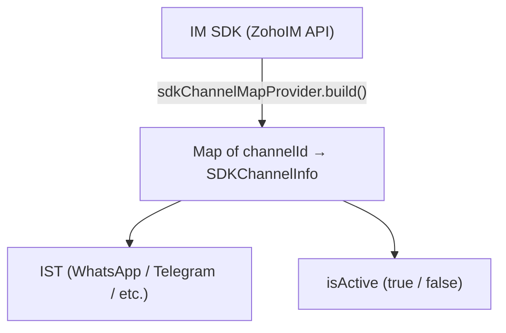

# SDK Truth Source — SDKChannelMapBuilder

## How It Works

The `SDKChannelMapProvider` calls the IM SDK once and returns a `Map<Long, SDKChannelInfo>` keyed by `channelId`. Each value contains:
- The IST the channel belongs to
- Whether the channel is currently active in the SDK

## Used For

| Use | How |
|---|---|
| Determine which IST a channel belongs to | `sdkChannelInfo.getIst()` |
| Check if UNKNOWN channel is actually active in SDK | `sdkChannelInfo.isActive()` |
| Group channels by IST for per-IST limit enforcement | Group by `sdkChannelInfo.getIst()` |

## Testability


`SDKChannelMapBuilder` itself is not directly unit-testable — it makes static SDK calls.

Callers mock the `SDKChannelMapProvider` **interface** instead. All handlers accept this interface via dependency injection, so tests can substitute a fake that returns controlled data.


## UNKNOWN Channel Not in SDK Map

If a channel is UNKNOWN but its `channelId` is **not present** in the SDK map at all, it means the channel was never registered in the SDK or was deleted. In this case the handler marks it **DISABLED** without making any SDK call.
