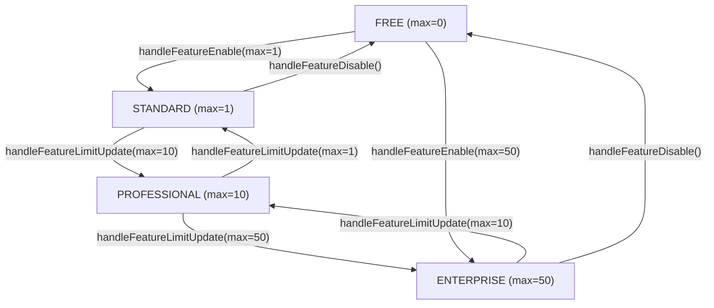
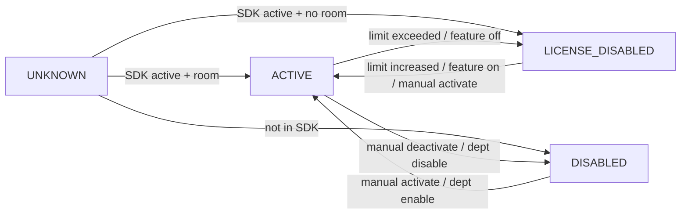

# Complete Visual: Every Plan Transition

## Plan Tier Diagram

## What Each Direction Does

### ⬆ On every UPGRADE

Triggered by `handleFeatureLimitUpdate(newMax)` or `handleFeatureEnable(max)` for Free→Paid:

1. Resolve UNKNOWN in disabled depts → LICENSE_DISABLED or DISABLED
2. Resolve UNKNOWN in active depts → ACTIVE / LICENSE_DISABLED / DISABLED
3. Trim excess ACTIVE if new limit < current count
4. **Re-enable LICENSE_DISABLED in active depts** (up to new limit)

### ⬇ On every DOWNGRADE

Triggered by `handleFeatureLimitUpdate(newMax)` or `handleFeatureDisable()` for Paid→Free:

1. LICENSE_DISABLE ACTIVE channels in disabled depts
2. Resolve UNKNOWN in disabled depts
3. Count current ACTIVE in active depts
4. Resolve UNKNOWN in active depts
5. **Trim excess ACTIVE** → LICENSE_DISABLED (TAIL first)
6. Re-enable LICENSE_DISABLED in active depts up to new limit (usually 0 room left)

## Channel Status Flow

